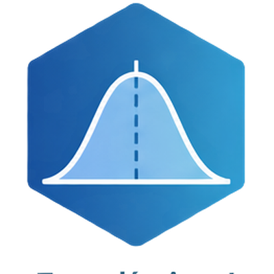
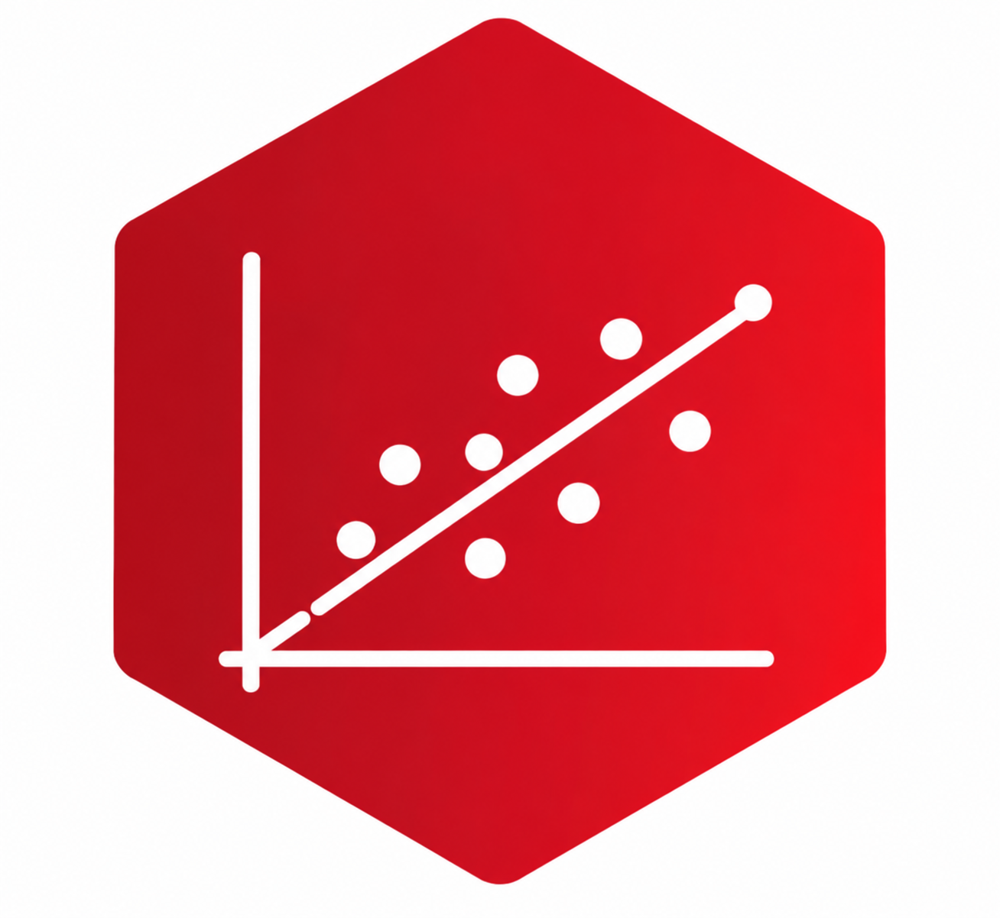
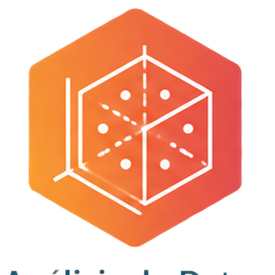

Mi experiencia docente se ha concentrado principalmente en la enseñanza de estadística, análisis de datos y métodos de investigación en ciencias sociales.

::: {.course-grid}

::: {.course-card}

{.course-image}

### Estadística I

**Departamento de Sociología**  
Universidad Alberto Hurtado  
2013–2018

:::

::: {.course-card}

{.course-image}

### Estadística II

**Departamento de Sociología**  
Universidad Alberto Hurtado  
2013–2018

:::

::: {.course-card}

{.course-image}

### Análisis de Datos Multivariados I

**Departamento de Sociología**  
Universidad Alberto Hurtado  
2013–2016

:::

::: {.course-card}

{.course-image}

### Análisis de Datos Multivariados II

**Departamento de Sociología**  
Universidad Alberto Hurtado  
2012–2016

:::

::: {.course-card}

{.course-image}

### Métodos Mixtos Cuantitativo y Cualitativo

**Departamento de Sociología**  
Universidad Alberto Hurtado  
2017

:::

::: {.course-card}

{.course-image}

### Estadística I

**Departamento de Ciencia Política y Relaciones Internacionales**  
Universidad Alberto Hurtado  
2012–2015

:::

::: {.course-card}

{.course-image}

### Estadística II

**Departamento de Ciencia Política y Relaciones Internacionales**  
Universidad Alberto Hurtado  
2011–2015

:::

:::
