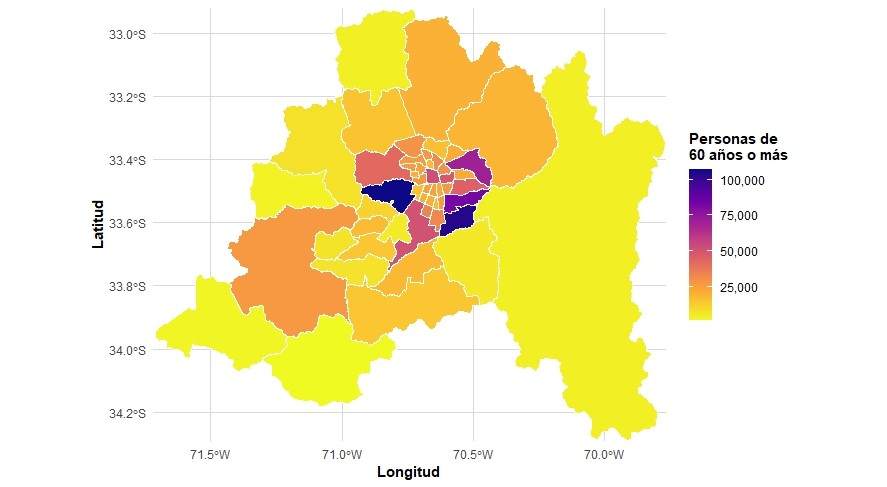
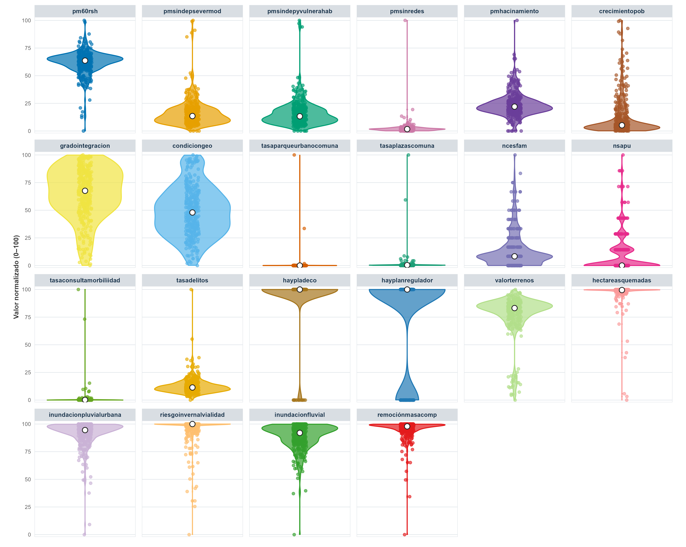

## Motivation

The development of Condominios de Viviendas Tuteladas (CVT) requires identifying territories where different demographic, social, territorial and institutional conditions create greater priority for intervention.

Territorial priority cannot be explained by a single indicator. Population characteristics, social vulnerability, housing conditions, territorial quality, institutional capacity and environmental risks vary considerably between communes.

The **Índice de Priorización Territorial para la Construcción de Condominios de Viviendas Tuteladas (IPT-CVT)** integrates these different dimensions into a single territorial prioritization framework.

The objective is to provide a quantitative framework to support territorial decision-making and the identification of communes where the construction of CVT may have greater relative priority.

## Data

The analysis covers **52 communes of the Metropolitan Region of Chile**.

The IPT-CVT integrates **22 territorial indicators** covering demographic, social, territorial, institutional and environmental conditions.

The data come from different administrative and territorial sources, including:

**CASEN · RSH / ADIS · INE · SENAMA · SII · Municipal and Territorial Data**

The resulting analytical matrix contains one row for each commune and one column for each territorial indicator.

### Territorial data matrix

<input 
  type="text" 
  id="cvt-search" 
  placeholder="Search communes..."
  style="width: 280px; padding: 8px 10px; border: 1px solid #999; font-size: 14px;"
>

## Method

The IPT-CVT was constructed as a composite territorial index.

The methodological process consists of several stages.

**1. Indicator construction**

Territorial indicators were constructed from demographic, social, institutional, environmental and territorial information.

**2. Normalization**

Indicators measured on different scales and units were transformed to a common scale to make them comparable.

**3. Direction**

Indicators were oriented so that their values consistently represented their contribution to territorial priority.

**4. Weighting**

Weights were assigned to indicators and dimensions according to the methodological framework of the index.

**5. Aggregation**

The normalized and weighted indicators were aggregated to produce a composite territorial prioritization score for each commune.

The resulting index allows communes to be compared according to their relative territorial priority for the construction of Condominios de Viviendas Tuteladas.

## Resultados

### Análisis descriptivo

Antes de presentar los resultados de la priorización territorial, se examina
la distribución espacial de la población de 60 años o más entre las comunas
de la Región Metropolitana de Santiago.

#### Distribución de la población de 60 años o más

El mapa muestra la distribución de las personas de 60 años o más en las
52 comunas de la Región Metropolitana. La intensidad del color representa
el número de personas de 60 años o más residentes en cada comuna, permitiendo
observar diferencias en su concentración territorial.

{fig-align="center" width="95%"}

#### Proporción de personas mayores sin redes de apoyo

La distribución territorial de las personas mayores sin redes de apoyo constituye
un antecedente relevante para caracterizar las condiciones sociales asociadas a
la necesidad potencial de apoyo y cuidados.

El siguiente mapa interactivo permite explorar la distribución de este indicador
entre las 52 comunas de la Región Metropolitana. La intensidad del color representa
la proporción de personas mayores sin redes de apoyo en cada comuna. Al seleccionar
una comuna es posible consultar su valor específico.

<iframe
  src="images/mapa_pmsinredes.html"
  width="100%"
  height="700"
  style="border: none;">
</iframe>

#### Distribution of normalized indicators

The distribution of the normalized indicators provides an overview of
the variation and concentration of territorial conditions across the
52 communes of the Metropolitan Region.

All indicators have been transformed to a common scale ranging from
0 to 100, allowing their relative territorial distributions to be
examined using a consistent metric. The violin plots show the density
of observations, while the individual points represent the normalized
values observed across communes. The white points indicate the median
value of each indicator.

{fig-align="center" width="100%"}

