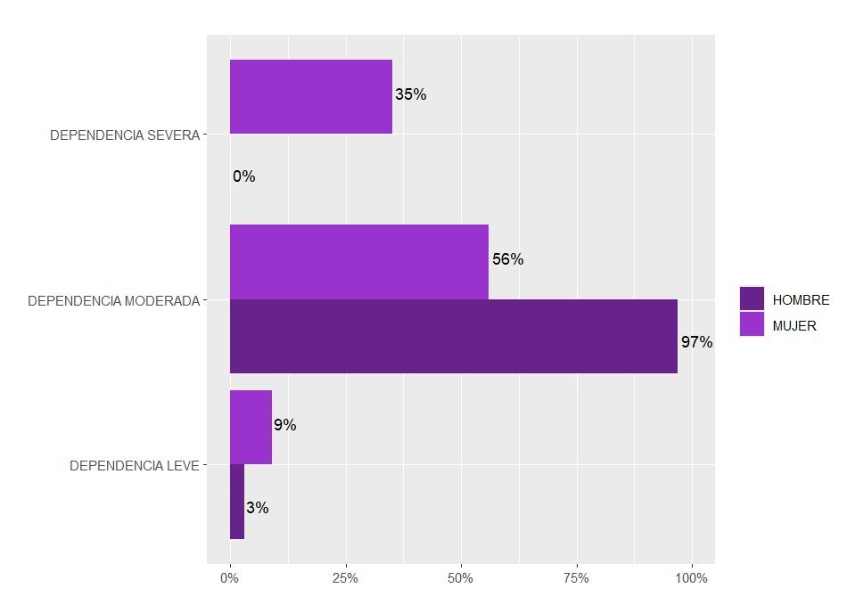
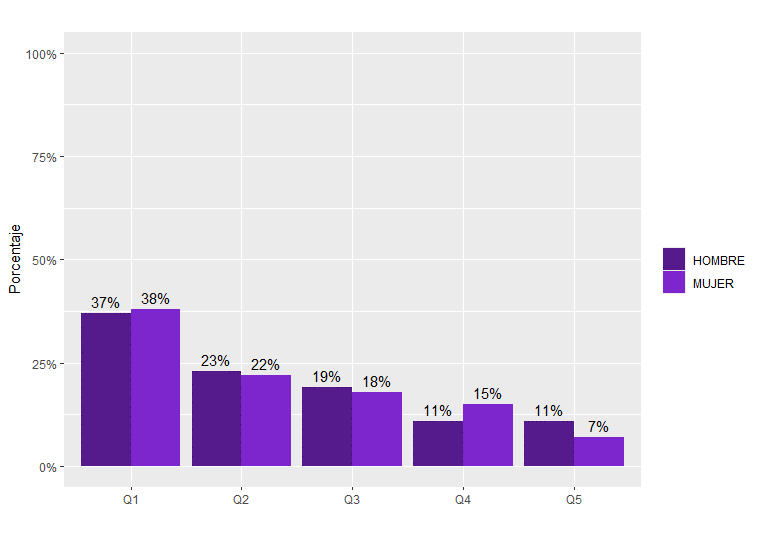
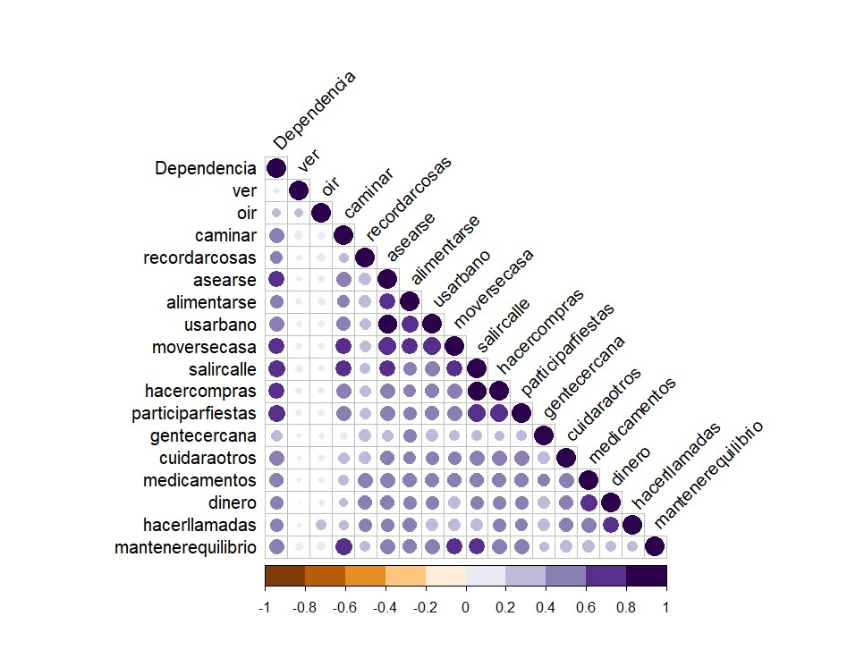
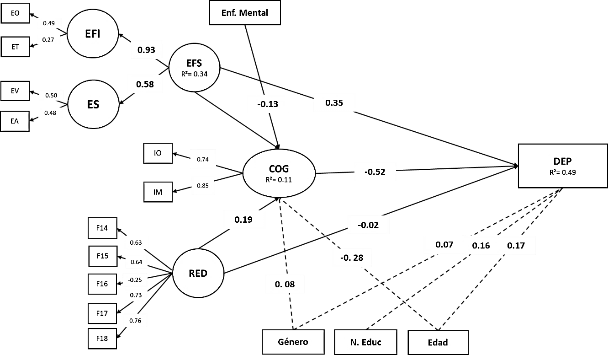

4.954personas mayores cuidadoras analizadas en dos encuestas nacionales

35%de las mujeres cuidadoras dependientes presenta dependencia severa (0% en hombres)

38%de las mujeres cuidadoras dependientes pertenece al quintil de menores ingresos

49%de la varianza de la dependencia explicada por el modelo SEM

## En breve

En Chile, muchas personas mayores cuidan a otras personas mayores. Este estudio analiza qué factores explican que estas personas cuidadoras desarrollen **dependencia funcional**, combinando salud, género, edad, educación, ingresos y redes de apoyo desde una perspectiva interseccional. El principal hallazgo: la dependencia no se explica solo por enfermedades, sino también por **desigualdades sociales**, y las **redes de apoyo** actúan como factor protector.

## Datos y método

**Fuentes:** Encuesta Nacional de Discapacidad y Dependencia ENDIDE 2022 (SENADIS–SENAMA; n = 1.093) y Encuesta Nacional de Calidad de Vida en la Vejez UC 2016, 2019 y 2022 (n = 3.861), con factores de expansión para representatividad nacional.

**Análisis:**

1. Estadística descriptiva y comparaciones por género.
2. Análisis bivariado: correlaciones entre dependencia y dificultad en actividades cotidianas.
3. Análisis factorial confirmatorio (AFC) para construir los factores latentes.
4. Modelo de ecuaciones estructurales (SEM) con estimador de máxima verosimilitud robusto.

**Herramientas:** R (`lavaan`, `ggplot2`, `corrplot`) y SPSS.

## Hallazgos principales

### 1. Las mujeres cuidadoras enfrentan una dependencia más severa

Entre las personas cuidadoras con dependencia funcional, el 35% de las mujeres presenta **dependencia severa**, mientras que ningún hombre alcanza ese nivel; en ellos predomina la dependencia moderada (97%).

### 2. La dependencia se concentra en los hogares de menores ingresos

El 38% de las mujeres cuidadoras con dependencia pertenece al **primer quintil de ingresos**, y la proporción disminuye a medida que aumenta el ingreso. Además, el ingreso promedio de las personas cuidadoras, hombres y mujeres, está bajo el salario mínimo.

### 3. La movilidad es lo que más se asocia a la dependencia

Todas las actividades cotidianas se correlacionan positivamente con la dependencia, pero las más fuertes son las de **movilidad**: salir a la calle (r = 0,70), participar en actividades sociales (r = 0,69), hacer compras (r = 0,67) y asearse (r = 0,65).

### 4. Salud, cognición, redes y desigualdad actúan en conjunto

El modelo final presenta un buen ajuste (CFI = 0,91; TLI = 0,90; RMSEA = 0,02) y explica el **49%** de la varianza de la dependencia funcional. Coeficientes estandarizados (β):

| Factor | Efecto sobre la dependencia | β |
|---|---|---|
| Buena cognición | La reduce | −0,52 |
| Enfermedades físico-sensoriales | La aumenta | 0,35 |
| Edad | La aumenta | 0,17 |
| Ser mujer | La aumenta | 0,07 |

Las **redes de apoyo** tienen un efecto protector indirecto: mejoran la cognición (β = 0,19), que a su vez reduce la dependencia. Las enfermedades mentales, en cambio, afectan la cognición (β = −0,14) pero no directamente la dependencia.

## Implicancias para política pública

- **Enfoque de género** en las políticas de cuidado: las mujeres mayores cuidan más años, con menos apoyo y con mayor dependencia severa.
- **Fortalecer redes de apoyo** para personas cuidadoras, por su efecto protector sobre la cognición y la funcionalidad.
- **Focalizar en los quintiles de menores ingresos**, donde se concentra la dependencia de las mujeres cuidadoras.
- **Abordaje integral de la salud**: la dependencia resulta de la combinación de factores físicos, cognitivos y sociales.
